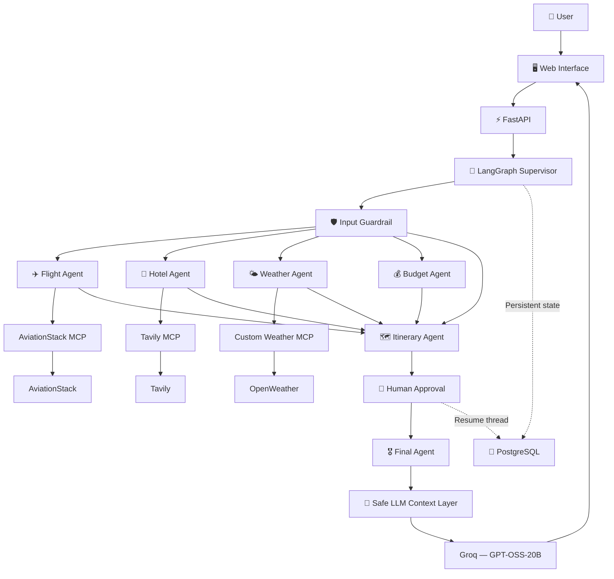

# 🏯 Shogun — Multi-Agent Travel Intelligence

> **One request. Multiple specialized agents. Explicit orchestration. Human-approved travel plans.**

Shogun is an AI-powered travel planning system built around **LangGraph, Model Context Protocol (MCP), FastAPI, Groq, PostgreSQL, and external travel intelligence services**.

Instead of sending every request through one monolithic prompt, Shogun routes work through specialized agents for **flights, hotels, weather, budgets, and itinerary generation**, with a supervisor deciding which agents are actually required.

The system also includes **input guardrails, deterministic routing checks, persistent LangGraph state, human-in-the-loop approval, and LLM context protection** for reliable execution under model token limits.

---

## ✨ What is Shogun?

Planning a trip normally means jumping between multiple services:

* ✈️ Search for flights
* 🏨 Research hotels
* 🌤️ Check weather
* 💰 Estimate the budget
* 🗺️ Build an itinerary
* 📝 Combine the useful information into one response

Shogun brings these capabilities into one AI-driven workflow.

A user can provide a natural-language request such as:

```text
Plan a 7-day trip from Delhi to Tokyo for two people
including flights, hotels, sightseeing and weather information.
```

The system determines which specialist agents are needed, gathers external information through MCP, creates an itinerary when requested, pauses for human approval, and then produces the final travel response.

---

## 🧠 Architecture



### Request lifecycle

```text
User Request
     │
     ▼
FastAPI
     │
     ▼
LangGraph Supervisor
     │
     ├──► Input Guardrail
     │
     ├──► Flight Agent ──► AviationStack MCP
     │
     ├──► Hotel Agent ───► Tavily MCP
     │
     ├──► Weather Agent ─► Custom Weather MCP
     │
     └──► Budget Agent
                  │
                  ▼
          Itinerary Agent
                  │
                  ▼
          Human Approval
             │         │
          Approve    Revise
             │         │
             └────┬────┘
                  ▼
             Final Agent
                  │
                  ▼
          Safe LLM Context
                  │
                  ▼
            Groq GPT-OSS-20B
                  │
                  ▼
          Travel Response
```

> **Important:** Not every request runs every agent. The supervisor routes only the specialists required for the user's request.

---

## 🤖 Multi-Agent System

### 🧠 Supervisor Agent

The Supervisor is the main routing layer. It determines which specialist agents are required for the user's specific request and extracts structured trip constraints such as:

* Origin
* Destination
* Duration
* Budget
* Travel style
* Special preferences

The supervisor uses narrow routing rules so a focused request such as a flight query does not unnecessarily trigger hotel, weather, budget, or itinerary agents.

For example:

```text
"Find me a flight from Delhi to Tokyo"
        ↓
ONLY flight_agent
```

while:

```text
"Plan a complete 7-day trip from Delhi to Tokyo"
        ↓
Flight + Hotel + Weather + Budget + Itinerary
```

---

### 🛡️ Input Guardrail

Before routing, Shogun checks whether the request belongs to travel planning or travel information.

Clearly unrelated or harmful/illegal requests can be blocked before specialist agents execute.

The guardrail is deliberately isolated from the specialist workflow so a guardrail failure can fall back safely rather than preventing valid travel requests from proceeding.

---

### ✈️ Flight Agent

The Flight Agent communicates with the AviationStack MCP server and retrieves aviation-related information such as airport and airline data.

The retrieved information is then converted into focused flight guidance by the LLM.

The agent is instructed not to fabricate live fares and not to silently turn an ambiguous destination such as `USA` into a specific city.

---

### 🏨 Hotel Agent

The Hotel Agent uses the Tavily MCP server to search the web for accommodation information relevant to the user's request.

The MCP server is loaded only when the hotel agent needs it, keeping unrelated integrations isolated.

---

### 🌤️ Weather Agent

The Weather Agent extracts the destination and communicates with the custom Weather MCP server.

It can retrieve:

* Current weather
* Forecast information

The resulting information can be used by the itinerary stage when an itinerary is requested.

---

### 💰 Budget Agent

The Budget Agent evaluates the trip against the user's stated budget and the information gathered by other selected agents.

It can provide:

* Estimated cost categories
* Budget risk areas
* Money-saving suggestions
* Overall feasibility

Estimates are explicitly treated as estimates when reliable live pricing is unavailable.

---

### 🗺️ Itinerary Agent

The Itinerary Agent is activated only when an itinerary or complete travel plan is requested.

It combines the relevant state gathered by the preceding agents and produces a draft itinerary suitable for human review.

---

### 👤 Human-in-the-Loop Approval

When an itinerary is generated, Shogun pauses the LangGraph workflow using an interrupt and presents the draft to the user.

The user can:

* ✅ Approve the itinerary
* ✏️ Reject it and provide revision feedback

The workflow is persisted using PostgreSQL checkpointing and can resume from the same `thread_id` after the human decision.

This makes human approval an actual workflow state rather than a frontend-only confirmation.

---

### 🎖️ Final Agent

After the workflow reaches finalization, the Final Agent synthesizes the relevant selected-agent results into a focused response.

It is instructed to:

* Answer only what the user asked
* Avoid unrelated travel sections
* Respect the selected-agent set
* Return one option when one option was requested
* Distinguish estimates from live pricing
* Preserve approved itinerary decisions

---

## 🛡️ LLM Context Protection

External MCP and search results can become large enough to exceed the model's request budget.

Shogun therefore includes a safety layer around `ChatGroq` calls that:

* Bounds oversized text contexts before they reach the model
* Preserves both the beginning and end of large retrieved content
* Applies a conservative default completion budget
* Protects LLM calls across the application, including the independently created LLM instance in `backend.py`

This prevents a large MCP/search context from accidentally causing the application to exceed its configured model request limits.

The protection is particularly important for the human-approval flow because the finalization step can otherwise receive a large combination of itinerary, search, flight, hotel, weather, and budget context.

---

# 🔌 MCP Integration

A core part of Shogun is its use of the **Model Context Protocol (MCP)**.

Instead of hard-coding every external integration directly into the application, Shogun communicates with MCP servers through a common tool interface.

### MCP services

| MCP Server | Purpose |
| --- | --- |
| 🔎 Tavily MCP | Web search and travel research |
| ✈️ AviationStack MCP | Aviation and airport information |
| 🌤️ Custom Weather MCP | Current weather and forecasts |

The MCP client loads the requested server and discovers its available tools dynamically.

Expected tool names include:

```text
tavily_search
get_current_weather
get_forecast
```

AviationStack tools are discovered dynamically from the configured MCP server.

---

# 🧠 Why LangGraph?

LangGraph provides the orchestration layer for Shogun.

The workflow is represented explicitly as a graph instead of hiding the complete application inside a single LLM call.

Conceptually:

```text
START
  │
  ▼
Supervisor + Guardrail
  │
  ├──► Selected Specialist Agents
  │
  ▼
Itinerary Agent (when required)
  │
  ▼
Human Approval
  │
  ▼
Final Agent
  │
  ▼
END
```

This makes the system easier to debug, extend, test, and reason about.

---

# ⚡ Tech Stack

| Technology | Role |
| --- | --- |
| **Python** | Core application language |
| **FastAPI** | Backend API and web server |
| **LangGraph** | Multi-agent workflow orchestration |
| **LangChain** | LLM and tool integration |
| **Groq / GPT-OSS-20B** | LLM used for routing, specialist reasoning, and synthesis |
| **MCP** | External tool/server integration |
| **Tavily** | Web search |
| **AviationStack** | Aviation information |
| **OpenWeather** | Weather information |
| **PostgreSQL** | Persistent LangGraph checkpoint storage |
| **Psycopg** | PostgreSQL connectivity |
| **HTML / CSS / JavaScript** | Frontend |
| **Uvicorn** | ASGI server |
| **Docker** | Containerization |

---

# 📁 Project Structure

```text
Shogun-using-MCP/
│
├── app.py                         # FastAPI application + API endpoints
├── backend.py                     # LangGraph state, agents and orchestration
├── mcp_client.py                  # MCP servers, tools and LLM safety layer
├── mcp_customserver.py            # Custom weather MCP server
│
├── tools/
│   ├── flight_tool.py
│   └── tavily_tool.py
│
├── utils/
│   └── pdf_export.py
│
├── templates/
│   └── index.html
│
├── static/
│   ├── style.css
│   └── script.js
│
├── test.py
├── requirements.txt
├── package.json
├── package-lock.json
├── Dockerfile
├── .dockerignore
├── .gitignore
└── README.md
```

---

# 🔄 Example Workflow

Suppose the user enters:

```text
Plan a 7-day trip from Delhi to Tokyo for two people
with flights, hotels, sightseeing and weather information.
```

### Step 1 — Request

The browser sends the request to:

```text
POST /api/travel
```

### Step 2 — Input validation

FastAPI validates the request and forwards it to the LangGraph orchestration layer.

### Step 3 — Guardrail and Supervisor

The guardrail validates that the request is appropriate for the travel application.

The supervisor determines the required specialist agents and extracts trip constraints.

### Step 4 — Specialist agents

The selected agents gather the relevant information:

```text
Flight Agent  → AviationStack MCP
Hotel Agent   → Tavily MCP
Weather Agent → Weather MCP
Budget Agent  → LLM analysis
```

### Step 5 — Itinerary generation

Because the request asks for a complete trip plan, the Itinerary Agent combines the relevant information into a draft.

### Step 6 — Human approval

The workflow pauses and displays the draft itinerary.

The user can approve the draft or provide revision feedback.

### Step 7 — Finalization

After approval, the workflow resumes from the persisted LangGraph checkpoint and produces the final response.

### Step 8 — Frontend

The final result is returned to the web interface for presentation.

---

# 💻 Local Setup

## 1. Clone the repository

```bash
git clone https://github.com/Ravisidh36/Shogun-using-MCP.git
cd Shogun-using-MCP
```

---

## 2. Create a virtual environment

### Windows

```powershell
python -m venv .venv
```

Activate it:

```powershell
.venv\Scripts\activate
```

---

## 3. Install Python dependencies

```bash
pip install -r requirements.txt
```

---

## 4. Install `uv`

AviationStack MCP is launched through `uvx`.

Install `uv`:

```bash
pip install uv
```

Verify:

```bash
uv --version
uvx --version
```

---

# 🔐 Environment Variables

Create a `.env` file in the project root.

```env
GROQ_API_KEY=your_groq_key
TAVILY_API_KEY=your_tavily_key
AVIATIONSTACK_API_KEY=your_aviationstack_key
OPENWEATHER_API_KEY=your_openweather_key
DATABASE_URL=your_postgresql_connection_string
```

### Never commit `.env`

Your API keys should remain private.

If you want to document required variables without exposing credentials, use a `.env.example` file.

---

# ▶️ Running Shogun

Start the application with:

```bash
python app.py
```

The FastAPI server runs locally at:

```text
http://127.0.0.1:8000
```

API documentation:

```text
http://127.0.0.1:8000/docs
```

Health check:

```text
http://127.0.0.1:8000/health
```

---

# 🧪 Testing

The repository includes `test.py` for validating core functionality.

Run:

```bash
python test.py
```

The MCP client also provides diagnostics for checking configured MCP servers and their available tools.

---

# 📡 API

## `GET /`

Serves the Shogun web interface.

---

## `GET /health`

Returns the application health status and enabled workflow features.

---

## `POST /api/travel`

Starts a travel-planning workflow.

### Request

```json
{
  "message": "Plan a 7 day trip to Tokyo for two people",
  "thread_id": null
}
```

### Response

The endpoint returns the current workflow result, selected agents, trip constraints, generated specialist results, and `thread_id`.

If an itinerary requires human approval, the response includes:

```json
{
  "requires_approval": true,
  "thread_id": "...",
  "itinerary": "..."
}
```

---

## `POST /api/travel/approve`

Resumes a paused workflow after human review.

### Approve

```json
{
  "thread_id": "your-thread-id",
  "approved": true,
  "feedback": ""
}
```

### Request revision

```json
{
  "thread_id": "your-thread-id",
  "approved": false,
  "feedback": "Make the itinerary less expensive and add more sightseeing."
}
```

When rejecting a draft, revision feedback is required.

---

# 💾 Persistent State

Shogun uses PostgreSQL together with LangGraph's PostgreSQL checkpointing support.

A `thread_id` identifies a travel-planning workflow. The same thread is used when the human approval endpoint resumes a paused workflow.

This allows the application to persist the workflow state across the human-in-the-loop boundary instead of restarting the entire planning process.

---

# 🎨 Frontend

Shogun uses a custom command-center inspired interface built around the project's Japanese/Shogun theme.

The interface includes:

* Travel request console
* Agent pipeline visualization
* Flight intelligence
* Hotel intelligence
* Weather information
* Budget/travel briefing
* Draft itinerary
* Human approval controls
* Campaign/history views
* Error and retry states

Quick example requests can be dispatched directly from the interface, and free-form requests are sent to the FastAPI travel endpoint.

The frontend is served directly through FastAPI using the project's `templates/` and `static/` directories.

---

# 🧩 Design Philosophy

### Specialized agents over one giant prompt

Each agent has a focused responsibility. The supervisor prevents unnecessary agents from running for focused questions.

This makes the system easier to:

* Debug
* Extend
* Test
* Reason about
* Replace individual integrations

### MCP for tool interoperability

MCP provides a standardized interface between the application and external tool providers.

New capabilities can be integrated as MCP tools without redesigning the entire orchestration layer.

### Graph-based orchestration

LangGraph makes execution flow explicit and provides checkpointed state and interrupt/resume behavior for human approval.

### Human approval as workflow state

The approval step is part of the graph itself. A user decision can pause and resume the workflow through a persisted `thread_id`.

### Context-aware LLM usage

External search and MCP results can become large. Shogun bounds LLM context before invoking Groq so large tool responses do not unnecessarily consume the model's request budget.

---

# ⚠️ Current Limitations

Shogun is an active project and some integrations are still evolving.

### Flight intelligence

The current Flight Agent uses AviationStack information together with LLM-generated travel guidance. It is not a complete airline booking engine or guaranteed live ticket-pricing system.

### External API dependency

Travel information depends on the availability, limits, and accuracy of external services such as Tavily, AviationStack, OpenWeather, and Groq.

### Model request limits

The application includes context-size protection, but Groq rate limits still depend on the configured model and service tier. Large workloads or high request volume can still be limited by the provider.

### API credentials

Running the complete system requires credentials for the configured external services.

### Production deployment

Additional hardening would be appropriate for production use, including stronger authentication, rate limiting, observability, secret management, and automated testing.

---

# 🔮 Future Improvements

Potential directions for Shogun include:

* ✈️ Richer live flight search and structured flight results
* 💳 More accurate fare and budget estimation
* 🏨 Structured hotel comparison
* 🌦️ More detailed weather-aware itinerary planning
* ⚡ Parallel agent execution where appropriate
* 🧠 Better result summarization before downstream LLM calls
* 💾 Context-aware caching
* 🔐 User authentication
* 📊 Observability and agent tracing
* 🧪 Expanded automated testing
* ☁️ Production deployment
* 📄 PDF travel-plan export
* 🔌 Additional MCP integrations

---

# 🌟 Why Shogun?

Shogun explores what happens when **LLM reasoning, graph-based orchestration, standardized tool integration, persistent state, and human approval** are combined into a real application.

The goal is not simply to ask an AI:

> "Plan my trip."

The goal is to build a system where specialized agents can **route work, gather information through external tools, pass relevant context through an explicit workflow, pause for human review, and collaborate toward a final travel response.**

---

## 📌 Project Status

**Active development**

Shogun is currently being developed as a multi-agent AI travel-planning and experimentation platform for LangGraph + MCP architectures.

---

## 📄 License

This project is licensed under the **MIT License**.

---

## 👨‍💻 Author

**Ravi Sidh**

GitHub: [@Ravisidh36](https://github.com/Ravisidh36)

---

<p align="center">
  Built with Python · FastAPI · LangGraph · MCP · Groq · PostgreSQL
</p>
