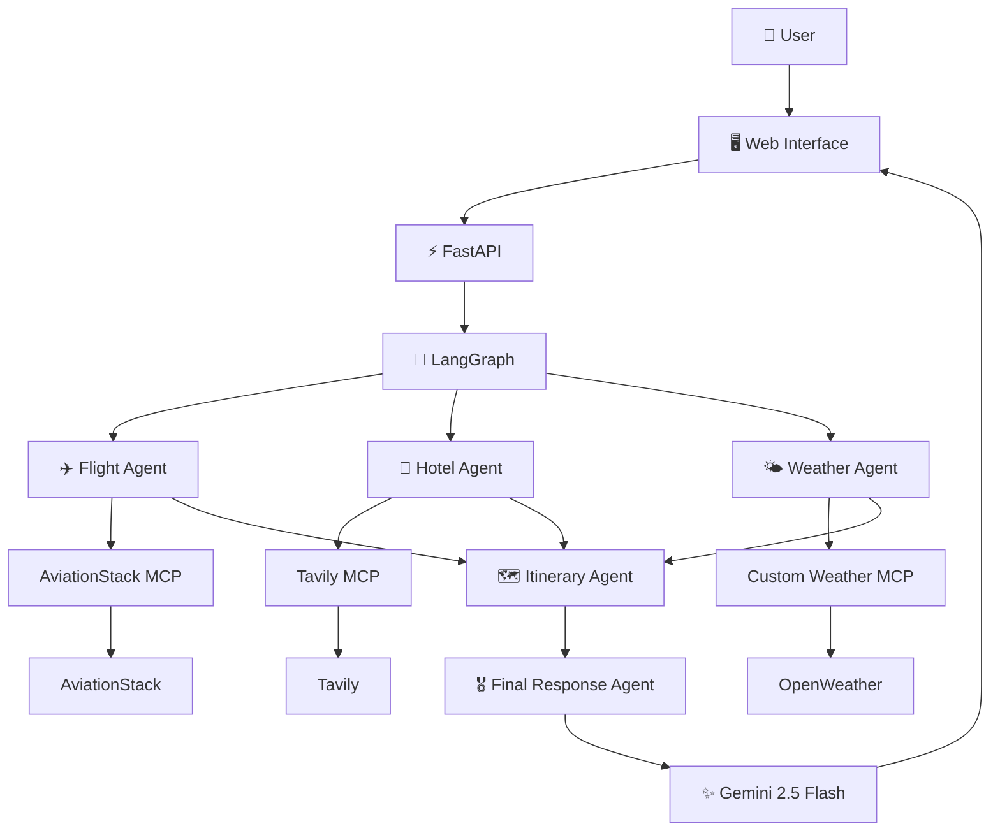

# 🏯 Shogun — Multi-Agent Travel Intelligence

> **One request. Multiple specialized agents. One complete travel briefing.**

Shogun is an AI-powered travel planning system that combines **LangGraph, Model Context Protocol (MCP), Gemini 2.5 Flash, FastAPI, and external travel intelligence services** to transform a natural-language travel request into a structured travel plan.

Instead of relying on one monolithic AI call, Shogun separates the planning process into specialized agents for **flights, hotels, weather, itinerary generation, and final response synthesis**.

---

## ✨ What is Shogun?

Planning a trip normally means jumping between multiple services:

* ✈️ Search for flights
* 🏨 Research hotels
* 🌤️ Check weather
* 🗺️ Build an itinerary
* 💰 Consider the budget
* 📝 Combine everything into one usable plan

Shogun brings these steps into a single AI-driven workflow.

A user can simply provide a request such as:

```text
Plan a 7-day trip to Tokyo for two people including
flights, hotels, sightseeing and weather information.
```

Shogun orchestrates the request through multiple specialized agents and produces a consolidated travel briefing.

---

## 🧠 Architecture



### Request lifecycle

```text
User Request
     │
     ▼
FastAPI
     │
     ▼
LangGraph Orchestrator
     │
     ├──► Flight Agent ──► AviationStack MCP
     │
     ├──► Hotel Agent ───► Tavily MCP
     │
     └──► Weather Agent ─► Weather MCP
                  │
                  ▼
          Itinerary Agent
                  │
                  ▼
          Final Response Agent
                  │
                  ▼
          Gemini 2.5 Flash
                  │
                  ▼
          Travel Briefing
```

---

## 🤖 Multi-Agent System

Shogun divides the planning task into specialized stages.

### ✈️ Flight Agent

The Flight Agent communicates with the AviationStack MCP server and retrieves aviation-related information such as airport and airline data.

The agent then uses the LLM to turn the retrieved information into useful travel guidance.

---

### 🏨 Hotel Agent

The Hotel Agent uses the Tavily MCP server to search the web for hotel and accommodation information relevant to the user's request.

This allows hotel research to be performed dynamically rather than relying entirely on static information.

---

### 🌤️ Weather Agent

The Weather Agent extracts the destination from the user's request and communicates with the custom Weather MCP server.

It retrieves:

* Current weather
* Forecast information

The weather information is then passed into the itinerary generation stage.

---

### 🗺️ Itinerary Agent

The Itinerary Agent receives information gathered by the other agents and generates a practical travel itinerary.

It considers:

* User requirements
* Flight information
* Hotel information
* Weather
* Trip duration
* Budget considerations

---

### 🎖️ Final Response Agent

The final agent synthesizes the gathered information into a single travel response.

The final briefing is structured around:

1. Trip Summary
2. Flight Information
3. Hotel Suggestions
4. Weather Information
5. Day-by-Day Itinerary
6. Estimated Budget
7. Final Recommendations

---

# 🔌 MCP Integration

A core part of Shogun is its use of the **Model Context Protocol (MCP)**.

Instead of hard-coding every external integration directly into the application, Shogun communicates with MCP servers through a common tool interface.

### MCP services

| MCP Server             | Purpose                          |
| ---------------------- | -------------------------------- |
| 🔎 Tavily MCP          | Web search and travel research   |
| ✈️ AviationStack MCP   | Aviation and airport information |
| 🌤️ Custom Weather MCP | Current weather and forecasts    |

The MCP client dynamically discovers and invokes tools exposed by these servers.

For example, the current client expects tools such as:

```text
tavily_search
get_current_weather
get_forecast
```

and dynamically discovers AviationStack tools exposed by its MCP server.

---

# 🧠 Why LangGraph?

LangGraph provides the orchestration layer for Shogun.

Instead of asking an LLM to perform every task in a single prompt, the system represents the workflow as a graph of specialized nodes.

Conceptually:

```text
START
  │
  ▼
Flight Agent
  │
  ▼
Hotel Agent
  │
  ▼
Weather Agent
  │
  ▼
Itinerary Agent
  │
  ▼
Final Response Agent
  │
  ▼
END
```

This makes the workflow easier to reason about, extend, and debug.

---

# ⚡ Tech Stack

| Technology                  | Role                                      |
| --------------------------- | ----------------------------------------- |
| **Python**                  | Core application language                 |
| **FastAPI**                 | Backend API and web server                |
| **LangGraph**               | Multi-agent workflow orchestration        |
| **LangChain**               | LLM and tool integration                  |
| **Gemini 2.5 Flash**        | Primary LLM                               |
| **MCP**                     | External tool/server integration          |
| **Tavily**                  | Web search                                |
| **AviationStack**           | Aviation information                      |
| **OpenWeather**             | Weather information                       |
| **PostgreSQL**              | Persistent application/checkpoint storage |
| **Psycopg**                 | PostgreSQL connectivity                   |
| **HTML / CSS / JavaScript** | Frontend                                  |
| **Uvicorn**                 | ASGI server                               |
| **Docker**                  | Containerization                          |

---

# 📁 Project Structure

```text
Shogun-using-MCP/
│
├── app.py
├── backend.py
├── mcp_client.py
├── mcp_customserver.py
│
├── tools/
│   ├── flight_tool.py
│   └── tavily_tool.py
│
├── utils/
│   └── pdf_export.py
│
├── templates/
│   └── index.html
│
├── static/
│   ├── style.css
│   └── script.js
│
├── test.py
├── requirements.txt
├── package.json
├── package-lock.json
├── Dockerfile
├── .dockerignore
├── .gitignore
└── README.md
```

---

# 🔄 Example Workflow

Suppose the user enters:

```text
Plan a 7-day trip from Delhi to Tokyo for two people
with flights, hotels, sightseeing and weather information.
```

### Step 1 — Request

The browser sends the request to:

```text
POST /api/travel
```

### Step 2 — FastAPI

FastAPI validates the request and forwards it to the travel orchestration layer.

### Step 3 — LangGraph

LangGraph executes the travel workflow.

### Step 4 — Flight Agent

The Flight Agent communicates with AviationStack through MCP.

### Step 5 — Hotel Agent

The Hotel Agent uses Tavily MCP to research relevant accommodation information.

### Step 6 — Weather Agent

The destination is extracted and weather information is retrieved through the Weather MCP server.

### Step 7 — Itinerary Agent

The collected information is passed to the itinerary generator.

### Step 8 — Final Agent

The final agent combines the results into a coherent travel briefing.

### Step 9 — Frontend

The result is returned to the web interface for presentation.

---

# 💻 Local Setup

## 1. Clone the repository

```bash
git clone https://github.com/Ravisidh36/Shogun-using-MCP.git
cd Shogun-using-MCP
```

---

## 2. Create a virtual environment

### Windows

```powershell
python -m venv .venv
```

Activate it:

```powershell
.venv\Scripts\activate
```

---

## 3. Install Python dependencies

```bash
pip install -r requirements.txt
```

The project also uses Google's Gemini integration, so if it is not already included in your environment:

```bash
pip install langchain-google-genai
```

---

## 4. Install `uv`

AviationStack MCP is launched through `uvx`.

Install `uv`:

```bash
pip install uv
```

Verify:

```bash
uv --version
uvx --version
```

---

# 🔐 Environment Variables

Create a `.env` file in the project root.

```env
GEMINI_API_KEY=your_gemini_key
TAVILY_API_KEY=your_tavily_key
AVIATIONSTACK_API_KEY=your_aviationstack_key
OPENWEATHER_API_KEY=your_openweather_key
DATABASE_URL=your_postgresql_connection_string
```

### Never commit `.env`

Your API keys should remain private.

A `.env.example` file can be used to document the required variables without exposing credentials.

---

# ▶️ Running Shogun

Start the application with:

```bash
python app.py
```

The FastAPI server runs locally at:

```text
http://127.0.0.1:8000
```

API documentation is available through FastAPI's generated documentation:

```text
http://127.0.0.1:8000/docs
```

Health check:

```text
http://127.0.0.1:8000/health
```

---

# 🧪 Testing

The repository includes `test.py` for validating the application's core functionality.

Run:

```bash
python test.py
```

The MCP client also contains diagnostics for checking the configured MCP servers and their available tools.

This is useful when troubleshooting external MCP integrations.

---

# 📡 API

## `GET /`

Serves the Shogun web interface.

---

## `GET /health`

Returns the application health status.

Example:

```json
{
  "status": "ok",
  "message": "AI Travel Planner API is running"
}
```

---

## `POST /api/travel`

Accepts a travel request.

### Request

```json
{
  "message": "Plan a 7 day trip to Tokyo for two people",
  "thread_id": null
}
```

### Response

The endpoint returns the generated travel briefing along with the workflow results and thread information.

---

# 💾 Persistent State

Shogun uses PostgreSQL together with LangGraph's PostgreSQL checkpointing support.

A `thread_id` identifies a travel-planning conversation, allowing the workflow to associate state with a particular session.

This provides a foundation for maintaining state across requests rather than treating every request as an entirely isolated execution.

---

# 🎨 Frontend

Shogun uses a custom command-center inspired interface designed around the project's Japanese/Shogun theme.

The interface includes:

* Travel request console
* Agent pipeline visualization
* Flight intelligence
* Hotel intelligence
* Travel briefing
* Draft itinerary
* Campaign history
* Error/retry states

The frontend is served directly through FastAPI using the project's `templates/` and `static/` directories.

---

# 🧩 Design Philosophy

### Specialized agents over one giant prompt

Each agent has a focused responsibility.

This makes the system easier to:

* Debug
* Extend
* Test
* Reason about
* Replace individual integrations

### MCP for tool interoperability

MCP provides a standardized interface between the application and external tool providers.

This means new capabilities can be integrated as MCP tools without redesigning the entire orchestration layer.

### Graph-based orchestration

LangGraph makes the execution flow explicit instead of hiding the entire application inside one LLM call.

### LLM as a reasoning layer

External services provide information.

Gemini provides the reasoning and synthesis layer that turns those results into useful travel guidance.

---

# ⚠️ Current Limitations

Shogun is an active project and some integrations are still evolving.

### Flight intelligence

The current Flight Agent uses AviationStack information together with LLM-generated travel guidance. It should not be interpreted as a complete airline booking engine or guaranteed live ticket-pricing system.

### External API dependency

Travel information depends on the availability, limits, and accuracy of external services such as Tavily, AviationStack, and OpenWeather.

### API credentials

Running the complete system requires credentials for the configured external services.

### Production deployment

The project currently focuses on the application architecture and working local workflow. Additional work would be required for a hardened production deployment.

---

# 🔮 Future Improvements

Potential directions for Shogun include:

* ✈️ Richer live flight search and structured flight results
* 💳 More accurate fare and budget estimation
* 🏨 Structured hotel comparison
* 🌦️ More detailed weather-aware itinerary planning
* 🧠 Parallel agent execution where appropriate
* ⚡ Response caching
* 🔐 User authentication
* 📊 Observability and agent tracing
* 🧪 Expanded automated testing
* ☁️ Production deployment
* 📄 PDF travel-plan export
* 🔌 Additional MCP integrations

---

# 🌟 Why Shogun?

Shogun is an exploration of what happens when **LLM reasoning, graph-based orchestration, and standardized tool integration** are combined into a real application.

The goal is not simply to ask an AI:

> "Plan my trip."

The goal is to build a system where different AI agents can **specialize, gather information through external tools, pass context through an explicit workflow, and collaborate toward one final result.**

---

## 📌 Project Status

**Active development**

Shogun is currently being developed as a multi-agent AI travel-planning system and experimentation platform for LangGraph + MCP based architectures.

---

## 📄 License

This project is licensed under the **MIT License**.

---

## 👨‍💻 Author

**Ravi Sidh**

GitHub: [@Ravisidh36](https://github.com/Ravisidh36)

---

<p align="center">
  Built with Python · FastAPI · LangGraph · MCP · Gemini
</p>
