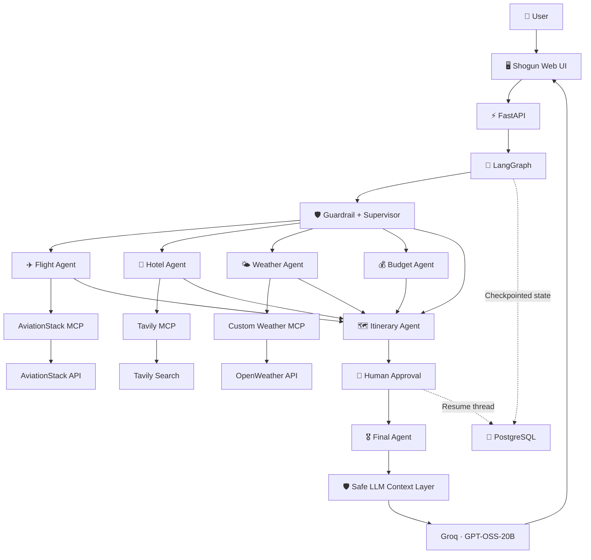

# 🏯 Shogun — Multi-Agent Travel Intelligence

> **One request. Multiple specialist agents. Explicit orchestration. Human-in-the-loop travel planning.**

Shogun is an AI-powered travel planning application that uses **LangGraph, LangChain, MCP, FastAPI, Groq, PostgreSQL, and external travel APIs** to turn natural-language travel requests into focused travel intelligence.

Instead of sending every request through one large prompt, Shogun uses a **Supervisor Agent** to determine which specialist agents are actually required. The system can work with flights, hotels, weather, budgets, and complete itineraries while keeping focused requests focused.

---

## ✨ Highlights

- 🧠 **Supervisor-based agent routing** — selects only the agents needed for the request.
- 🛡️ **Input guardrail** — validates that requests belong to the travel domain and can block clearly unrelated or harmful requests.
- ✈️ **Flight intelligence** — integrates AviationStack through MCP for aviation and airport information.
- 🏨 **Hotel research** — uses Tavily MCP for web-based accommodation research.
- 🌤️ **Weather intelligence** — uses a custom MCP server backed by OpenWeather.
- 💰 **Budget analysis** — evaluates estimated costs, budget risks, and saving opportunities.
- 🗺️ **Itinerary generation** — creates a complete draft only when an itinerary or full trip plan is requested.
- 👤 **Human-in-the-loop approval** — pauses before finalizing an itinerary so the user can approve or request revisions.
- 💾 **Persistent workflow state** — PostgreSQL checkpointing keeps LangGraph threads resumable.
- 🧠 **LLM context protection** — bounds large MCP/search contexts before they reach Groq.
- 🖥️ **Command-center style frontend** — displays the agent pipeline, results, approval workflow, and previous sessions.
- 📄 **Result export support** — the frontend includes a PDF export action for generated travel results.

---

## 🎯 What Problem Does Shogun Solve?

Travel planning often requires switching between several services:

```text
Flights → Hotels → Weather → Budget → Sightseeing → Itinerary
```

Shogun brings these steps into a single orchestrated workflow.

For example:

```text
User:
"Find me a flight from Delhi to Tokyo"

Supervisor:
        ↓
flight_agent only
        ↓
AviationStack MCP
        ↓
Focused flight response
```

A more complete request can activate the broader workflow:

```text
User:
"Plan a 7-day trip from Jaipur to Tokyo for two people,
including flights, hotels, sightseeing and weather."

        ↓
Supervisor
        ↓
Flight + Hotel + Weather + Budget + Itinerary
        ↓
Human Approval
        ↓
Final Agent
        ↓
Complete travel response
```

The important design principle is that **not every request runs every agent**.

---

# 🧠 Architecture



### Core execution flow

```text
                         ┌──────────────────┐
                         │    User Request  │
                         └────────┬─────────┘
                                  │
                                  ▼
                         ┌──────────────────┐
                         │     FastAPI      │
                         └────────┬─────────┘
                                  │
                                  ▼
                    ┌──────────────────────────┐
                    │ LangGraph Supervisor     │
                    │ + Input Guardrail        │
                    └────────────┬─────────────┘
                                 │
                  ┌──────────────┼──────────────┐
                  ▼              ▼              ▼
             Flight Agent   Hotel Agent   Weather Agent
                  │              │              │
                  ▼              ▼              ▼
               Aviation        Tavily       OpenWeather
                 MCP             MCP         Weather MCP
                  │              │              │
                  └──────────────┼──────────────┘
                                 ▼
                          Budget Agent
                                 │
                                 ▼
                         Itinerary Agent
                                 │
                                 ▼
                         Human Approval
                            │         │
                         Approve    Revise
                            │         │
                            └────┬────┘
                                 ▼
                           Final Agent
                                 │
                                 ▼
                         Groq GPT-OSS-20B
                                 │
                                 ▼
                           Web Interface
```

---

# 🤖 Agent System

## 🧠 Supervisor Agent

The Supervisor is responsible for understanding the user's request and selecting the required specialist agents.

It extracts structured trip constraints including:

- Origin
- Destination
- Duration
- Budget
- Travel style
- Special preferences

The supervisor is deliberately instructed to avoid unnecessary agents.

For example:

| User request | Agents selected |
| --- | --- |
| Flight from Delhi to Tokyo | Flight Agent |
| Hotels in Tokyo | Hotel Agent |
| Weather in Tokyo | Weather Agent |
| Budget for a Tokyo trip | Budget Agent |
| Complete Tokyo trip plan | Flight + Hotel + Weather + Budget + Itinerary |

If the LLM supervisor cannot produce valid routing JSON, Shogun has a deterministic fallback router based on the request intent.

---

## 🛡️ Input Guardrail

Before specialist agents execute, the request passes through a travel-domain guardrail.

Valid requests can cover topics such as:

- Destinations
- Flights
- Hotels
- Weather
- Budgets
- Transportation
- Sightseeing
- Food
- Packing
- Itineraries
- Visa and travel information

Clearly unrelated requests and requests asking for harmful or illegal instructions can be blocked.

The guardrail also has a safe fallback so a guardrail parsing failure does not automatically prevent a valid travel request from continuing.

---

## ✈️ Flight Agent

The Flight Agent communicates with the **AviationStack MCP server**.

It retrieves aviation-related information such as:

- Airport information
- Airline information
- Route-related aviation context

The agent is intentionally constrained to flight-related questions and does not generate unrelated hotel, weather, budget, or itinerary sections.

### Destination safety

Shogun includes a deterministic check for ambiguous U.S. destinations.

For example:

```text
"Find me a flight from Delhi to USA"
```

does **not** silently become New York/JFK.

Instead, the system asks the user to specify a U.S. city or airport.

The flight agent also avoids claiming a fare is the **cheapest** or live when the connected data does not reliably provide live ticket pricing.

---

## 🏨 Hotel Agent

The Hotel Agent uses **Tavily MCP** for web research related to accommodation.

The MCP client loads the Tavily server when the hotel workflow requires it rather than forcing every request through every external integration.

---

## 🌤️ Weather Agent

The Weather Agent first extracts the destination and then communicates with the custom weather MCP server.

The custom server exposes:

```text
get_current_weather(city)
get_forecast(city)
```

The server calls **OpenWeather** and returns structured weather information such as temperature, feels-like temperature, humidity, wind, conditions, and forecast entries.

---

## 💰 Budget Agent

The Budget Agent analyzes the trip against the user's stated budget and available travel information.

It can provide:

1. Estimated cost categories
2. Budget risk areas
3. Money-saving suggestions
4. Overall feasibility

When exact live pricing is unavailable, the system treats costs as estimates rather than presenting them as confirmed prices.

---

## 🗺️ Itinerary Agent

The Itinerary Agent is activated when the user asks for an itinerary, day-by-day plan, complete trip, or broader travel plan.

It combines relevant information from the selected agents and creates a draft itinerary for review.

A focused query such as:

```text
"What is the weather in Tokyo?"
```

does not need to generate a complete itinerary.

---

# 👤 Human-in-the-Loop

One of Shogun's main workflow features is explicit human approval.

When an itinerary is generated, the LangGraph workflow pauses using `interrupt()`.

The frontend displays the draft and allows the user to:

- ✅ Approve the itinerary
- ✏️ Reject it and provide revision feedback

The workflow is associated with a persistent `thread_id`.

After the user responds, the application resumes the same LangGraph thread using a `Command(resume=...)` call.

This makes approval a real workflow state rather than a visual frontend confirmation.

### Approval flow

```text
Itinerary Agent
       │
       ▼
  Draft Itinerary
       │
       ▼
 Human Approval
    │       │
    │       └───────────────┐
    ▼                       ▼
 Approve                  Revise
    │                       │
    │                 Human Feedback
    │                       │
    └───────────┬───────────┘
                ▼
           Final Agent
```

---

# 🛡️ LLM Context Protection

MCP and web-search responses can become large. Passing too much retrieved content into an LLM request can exceed the model's request/token budget.

Shogun therefore includes a safety layer around `ChatGroq` invocation that:

- Bounds oversized text contexts before sending them to the model
- Preserves both the beginning and end of large contexts
- Applies a conservative default completion budget
- Protects the independently created `ChatGroq` instance used by the backend

The current implementation uses a bounded text context and a default completion budget of **1200 tokens**.

This is especially useful for workflows where several specialist outputs are combined before final synthesis.

> This layer is a request-size safeguard, not a replacement for proper context summarization. Future versions can further reduce token usage by summarizing MCP results before passing them between agents.

---

# 🔌 Model Context Protocol (MCP)

MCP is used as the integration layer between Shogun and external tools/services.

### Connected MCP services

| MCP server | Transport | Purpose |
| --- | --- | --- |
| **Tavily MCP** | Streamable HTTP | Web/travel research |
| **AviationStack MCP** | stdio via `uvx` | Aviation information |
| **Custom Weather MCP** | stdio | Weather + forecast via OpenWeather |

The MCP client dynamically loads tools from the server that is required by the current agent.

This keeps external integrations modular and allows individual servers to fail without necessarily breaking unrelated workflows.

---

# 🧩 Why LangGraph?

LangGraph is used because the application is a **stateful workflow**, not simply a single LLM prompt.

The graph needs to support:

- Conditional agent routing
- Shared workflow state
- Multiple specialist stages
- Human interruption
- Workflow resumption
- Persistent checkpoints
- Deterministic routing safeguards

Conceptually:

```text
START
  │
  ▼
Supervisor
  │
  ├── Flight
  ├── Hotel
  ├── Weather
  ├── Budget
  └── Itinerary (when required)
              │
              ▼
       Human Approval
              │
              ▼
         Final Agent
              │
              ▼
             END
```

---

# 💾 Persistence

Shogun uses **PostgreSQL** with LangGraph's PostgreSQL checkpointing support.

Each workflow is associated with a `thread_id`.

The same thread is used when an itinerary is paused for approval and later resumed.

This allows the system to retain workflow state across the human-in-the-loop boundary.

---

# 🖥️ Frontend

The frontend is a custom Japanese/Shogun-inspired command center built with HTML, CSS, and JavaScript.

### Main interface features

- Mission planning form
- Destination, travel date, traveler count, and trip-style inputs
- Optional free-form trip details
- Quick example requests
- Animated agent pipeline
- Supervisor and specialist status display
- Focused result panels
- Flight information cards when structured flight data is available
- Weather cards and forecast presentation
- Hotel and itinerary result panels
- Human approval controls
- Revision feedback input
- Previous campaign/session history
- Reopen previous results
- New campaign/reset action
- PDF export action
- Responsive interface

The frontend communicates with the FastAPI backend through:

```text
POST /api/travel
POST /api/travel/approve
```

---

# 📁 Project Structure

```text
Shogun-using-MCP/
│
├── app.py                    # FastAPI application and API endpoints
├── backend.py                # LangGraph state, routing, agents and workflow
├── mcp_client.py             # MCP client, integrations and LLM safety layer
├── mcp_customserver.py       # Custom OpenWeather MCP server
│
├── templates/
│   └── index.html             # Main frontend page
│
├── static/
│   ├── script.js              # Frontend controller
│   ├── script-core.js         # Frontend compatibility/core loader
│   └── style.css              # Shogun interface styling
│
├── utils/
│   └── pdf_export.py          # PDF export utilities
│
├── .claude/                   # Claude/project configuration
├── Dockerfile                 # Container configuration
├── requirements.txt            # Python dependencies
├── package.json                # Frontend dependency metadata
├── package-lock.json
├── test.py                     # Project test/diagnostic entry point
├── LICENSE
├── .gitignore
└── README.md
```

---

# ⚙️ Tech Stack

| Technology | Purpose |
| --- | --- |
| **Python 3.11** | Application runtime |
| **FastAPI** | Backend API and web server |
| **LangGraph** | Stateful multi-agent orchestration |
| **LangChain** | LLM and application integration |
| **Groq** | LLM inference |
| **GPT-OSS-20B** | Current configured Groq model |
| **MCP** | External tool integration |
| **Tavily** | Web search |
| **AviationStack** | Aviation information |
| **OpenWeather** | Weather information |
| **PostgreSQL** | LangGraph checkpoint persistence |
| **Psycopg** | PostgreSQL connection |
| **Jinja2** | HTML templating |
| **Uvicorn** | ASGI server |
| **HTML/CSS/JavaScript** | Frontend |
| **Docker** | Containerization |

---

# 🔐 Environment Variables

Create a `.env` file in the project root:

```env
GROQ_API_KEY=your_groq_api_key
TAVILY_API_KEY=your_tavily_api_key
AVIATIONSTACK_API_KEY=your_aviationstack_api_key
OPENWEATHER_API_KEY=your_openweather_api_key
DATABASE_URL=your_postgresql_connection_string
```

The MCP client accepts both of these AviationStack variable names:

```env
AVIATIONSTACK_API_KEY=your_key
```

or:

```env
AVIATION_STACK_API_KEY=your_key
```

### ⚠️ Keep credentials private

Do not commit `.env` or API keys to GitHub.

For a public repository, consider adding a `.env.example` containing placeholder values only.

---

# 🚀 Local Setup

## 1. Clone the repository

```bash
git clone https://github.com/Ravisidh36/Shogun-using-MCP.git
cd Shogun-using-MCP
```

## 2. Create a virtual environment

### Windows

```powershell
python -m venv .venv
.venv\Scripts\activate
```

### macOS / Linux

```bash
python3 -m venv .venv
source .venv/bin/activate
```

## 3. Install dependencies

```bash
pip install -r requirements.txt
```

## 4. Install `uv`

AviationStack MCP is launched through `uvx`.

```bash
pip install uv
```

Verify the installation:

```bash
uv --version
uvx --version
```

## 5. Configure environment variables

Create `.env` and add the required API keys and PostgreSQL connection string.

## 6. Start the application

```bash
python app.py
```

The application will be available at:

```text
http://127.0.0.1:8000
```

FastAPI documentation:

```text
http://127.0.0.1:8000/docs
```

Health check:

```text
http://127.0.0.1:8000/health
```

---

# 🐳 Docker

The repository includes a Dockerfile based on Python 3.11.

Build the image:

```bash
docker build -t shogun-travel .
```

Run it:

```bash
docker run --env-file .env -p 8000:8000 shogun-travel
```

Then open:

```text
http://127.0.0.1:8000
```

The container starts the FastAPI application with Uvicorn on port `8000`.

---

# 📡 API Reference

## `GET /`

Returns the Shogun web interface.

---

## `GET /health`

Returns the application health status and enabled workflow features.

Example:

```json
{
  "status": "ok",
  "message": "TripMate AI API is running",
  "features": [
    "supervisor_agent",
    "input_guardrail",
    "human_in_the_loop",
    "budget_agent"
  ]
}
```

---

## `POST /api/travel`

Starts a new travel-planning workflow or continues a workflow when a `thread_id` is supplied.

### Request

```json
{
  "message": "Plan a 7 day trip from Jaipur to Tokyo for two people",
  "thread_id": null
}
```

### Important behavior

The backend normalizes the free-form request before sending it to the LangGraph workflow. If the frontend contains stale structured values but the user enters a focused instruction such as a flight request in the free-form field, the focused instruction is preferred.

### Response

The response can contain:

```json
{
  "success": true,
  "thread_id": "...",
  "answer": "...",
  "requires_approval": false,
  "selected_agents": ["flight_agent"],
  "trip_constraints": {},
  "flight_results": "...",
  "hotel_results": "...",
  "weather_results": "...",
  "budget_results": "...",
  "itinerary": "...",
  "supervisor_reasoning": "...",
  "guardrail_allowed": true,
  "llm_calls": 1
}
```

When an itinerary requires human review, the response includes:

```json
{
  "requires_approval": true,
  "thread_id": "...",
  "approval_request": "Please review the generated draft itinerary...",
  "itinerary": "..."
}
```

---

## `POST /api/travel/approve`

Resumes a paused workflow after the user reviews the itinerary.

### Approve

```json
{
  "thread_id": "your-thread-id",
  "approved": true,
  "feedback": ""
}
```

### Request a revision

```json
{
  "thread_id": "your-thread-id",
  "approved": false,
  "feedback": "Make the itinerary less expensive and add more sightseeing."
}
```

When rejecting a draft, feedback is required.

---

# 🧪 Testing and Diagnostics

The repository contains `test.py` for project-level checks.

Run:

```bash
python test.py
```

The MCP client also includes a diagnostic helper that can independently test the configured Tavily, AviationStack, and Weather MCP servers.

This is useful when debugging API keys, `uvx`, MCP connectivity, or the custom weather server.

---

# 🔄 Example End-to-End Workflow

### User request

```text
Plan a 5-day trip from Jaipur to Bali for two people,
including flights, hotels, weather and sightseeing.
```

### 1. FastAPI

The browser sends the request to:

```text
POST /api/travel
```

### 2. Guardrail

The request is checked to ensure that it belongs to the supported travel domain.

### 3. Supervisor

The Supervisor selects the required agents and extracts trip constraints.

### 4. Specialist agents

```text
Flight Agent   → AviationStack MCP
Hotel Agent    → Tavily MCP
Weather Agent  → Custom Weather MCP → OpenWeather
Budget Agent   → Groq analysis
```

### 5. Itinerary

The Itinerary Agent combines the relevant results into a draft plan.

### 6. Human review

The graph pauses and the frontend presents the draft.

```text
Approve → continue
Reject  → provide feedback → revise/finalize
```

### 7. Final response

The Final Agent synthesizes the relevant information while following constraints such as:

- Do not add unrelated sections
- Respect the selected-agent set
- Preserve approved itinerary decisions
- Do not invent live prices
- Do not call an option "cheapest" without reliable pricing support
- Return exactly one option when the user requests one

---

# 🧱 Design Principles

### 1. Explicit orchestration

Agent behavior is represented in a LangGraph state machine rather than hidden inside one giant prompt.

### 2. Narrow routing

Focused questions should activate focused agents.

### 3. Deterministic safeguards

High-impact assumptions, such as converting `USA` into a particular city, are protected by deterministic logic rather than relying entirely on the LLM.

### 4. Tool isolation

MCP servers are loaded according to the current agent's needs.

### 5. Human control

Itinerary generation includes a genuine approval checkpoint before finalization.

### 6. Persistent state

PostgreSQL checkpointing allows workflows to pause and resume using a stable `thread_id`.

### 7. Context awareness

Large external results are bounded before they are sent to the LLM to reduce request-size failures.

---

# ⚠️ Current Limitations

- AviationStack integration provides aviation/airport information but should not be treated as a guaranteed source of live bookable ticket prices.
- Hotel information depends on Tavily search availability and search quality.
- Weather information depends on OpenWeather availability and API limits.
- Groq request limits can still affect the application even with context protection.
- Budget values are estimates unless reliable live pricing is available.
- A PostgreSQL database is required for the configured checkpointing workflow.
- `uvx` is required for the AviationStack MCP subprocess.
- The current LLM context protection is a safety boundary; more aggressive result summarization/caching can further reduce token usage.

---

# 🔮 Future Improvements

Potential next steps include:

- 🔎 More precise live flight-price integrations
- 🧾 Structured flight and hotel result normalization
- 🧠 Dedicated context summarization between agents
- ⚡ MCP result caching
- 💾 Persistent travel history
- 🔐 Stronger API validation and rate limiting
- 🧪 Expanded unit and integration tests
- 📊 Observability and agent-level tracing
- 🌍 More travel data providers
- 🚀 Production deployment configuration

---

# 📜 License

This project is released under the license included in the repository's `LICENSE` file.

---

# 👨‍💻 Author

**Ravi Sidh**

GitHub: [Ravisidh36](https://github.com/Ravisidh36)

---

<p align="center">
  Built with Python · FastAPI · LangGraph · LangChain · MCP · Groq · PostgreSQL
</p>
